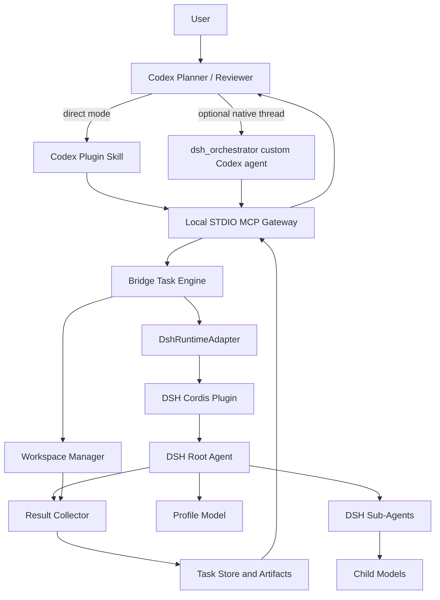
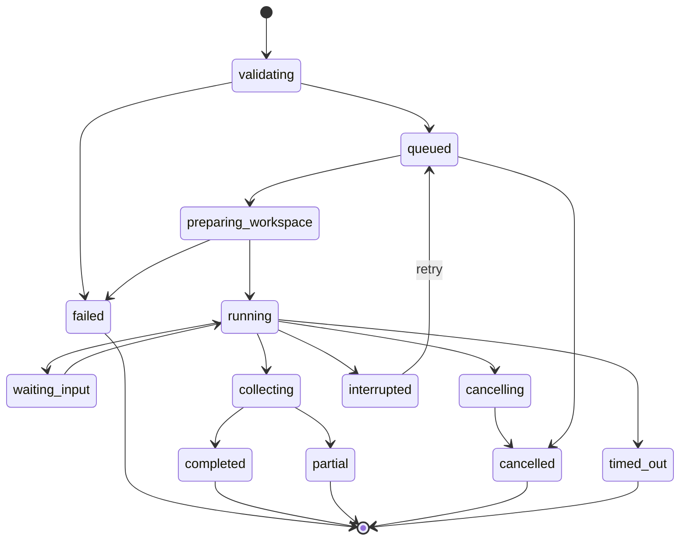
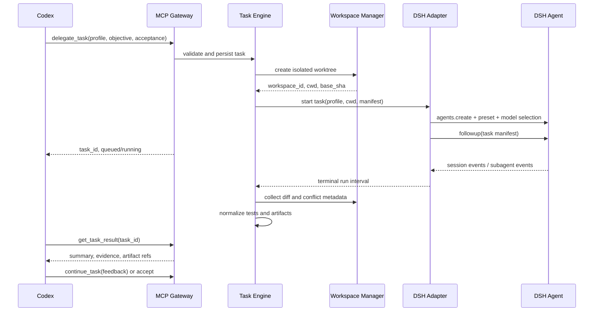

# 软件架构规划

## 1. 架构目标

- Codex 保留规划、委派和最终验收权。
- DSH 负责模型路由、具体实现、内部 Sub-Agent 和工具执行。
- DSH Plugin 与 Codex Plugin 同版本发布，共享同一 Protocol Schema。
- 默认本地、异步、隔离、可取消、可审查。
- Host 协议不暴露 DSH Cordis 类型，未来可以增加 Claude Code Adapter。

非目标：替换 Codex 原生 Sub-Agent 引擎、Fork Codex/DSH、首版远程 SaaS、首版 Dashboard、自动合并到主分支。

## 2. 推荐总体架构



关键决策：MCP Gateway 与 DSH Runtime 默认在同一个 `dsh --profile codex-bridge` 进程中。它们在代码上分层，在部署上合并，既保留取消能力，也减少进程和 IPC 复杂度。

## 3. 两端插件职责

### 3.1 Codex Plugin

当前插件内容：

```text
plugins/dsh-codex-bridge/
├── .codex-plugin/plugin.json
├── .mcp.json
├── skills/
│   ├── setup-dsh-bridge/SKILL.md
│   └── delegate-to-dsh/SKILL.md
├── assets/
│   └── dsh-orchestrator.toml
└── README.md
```

职责：

- 声明本地 MCP Server 启动命令。
- 在配置尚未就绪时保留 Setup-only MCP，让 Codex 可以诊断状态和发现 DSH 模型。
- 通过设置 Skill 完成首次引导、Profile 预览/写入、Revision 保护和回滚。
- 通过 Skill 教 Codex 何时委派、如何选择 Profile、如何审查结果。
- 默认指示 Codex 主线程直接调用 MCP，避免不必要的 Codex Sub-Agent。
- 提供可选模板，由 `bridge init --codex-agent` 写入项目 `.codex/agents/dsh-orchestrator.toml`。
- 不保存 DSH Provider 密钥，不复制 DSH Profile 配置。

### 3.2 DSH Plugin Bundle

职责：

- 以 Cordis Plugin 形式注册 Bridge Task Service。
- 通过 `ctx.agents.create()` / `resume()` 管理 Agent 生命周期。
- 在 Agent `setup()` 中挂载 DSH Agent Preset，并调用 `installModelSelection()`。
- 监听 Session/Agent/Sub-Agent 事件，派生 Bridge 状态。
- 将 Bridge Policy 转换为 DSH Sandbox、工具过滤和资源限制。
- 提供 `dsh.bundle` patch，组成无 Web、无 stdout logger 的 `codex-bridge` Profile。

### 3.3 共享核心

- `protocol`：Host-neutral schema、状态机、错误码、版本协商。
- `task-engine`：Task 生命周期、并发、超时、继续、取消、Reconcile。
- `workspace`：Allowed Root、Git Worktree、临时副本、清理和冲突检测。
- `artifacts`：Patch、测试报告、日志摘要、Hash、分页读取。
- `dsh-runtime`：唯一允许导入 DSH Runtime 包的边界。

## 4. 当前仓库结构

```text
dsh-codex-bridge/
├── packages/
│   ├── protocol/
│   ├── config/
│   ├── task-engine/
│   ├── workspace/
│   ├── artifacts/
│   ├── dsh-runtime/
│   ├── dsh-plugin/
│   ├── mcp-server/
│   └── cli/
├── plugins/
│   └── dsh-codex-bridge/
├── tests/
│   ├── e2e/
│   └── fixtures/
├── docs/
│   ├── adr/
│   ├── installation.md
│   ├── usage.md
│   ├── compatibility.md
│   ├── security.md
│   └── troubleshooting.md
├── scripts/
├── .changeset/
├── bridge.example.yaml
├── package.json
├── pnpm-workspace.yaml
├── LICENSE
└── SECURITY.md
```

建议使用 TypeScript、Node `^22.19 || >=24`、pnpm workspace、Zod、官方 `@modelcontextprotocol/sdk`、Vitest。Node 基线跟随当前 DSH 要求，避免维护两套运行时。

## 5. 运行模式

### 5.1 Direct Mode（默认）

Codex 主线程直接调用 Bridge MCP。自然语言“使用 DSH 处理”会激活 Skill；Codex 先按工作流独立性解析 `single` / `multi`，再提交结构化决策。DSH 执行期间 Codex 可以做独立工作，之后查询任务。优点是最省 Codex token；缺点是 DSH 子任务不会显示成 Codex 原生 Agent Thread。

### 5.2 Native Shell Mode（可选）

Codex Spawn 一个窄职责的 `dsh_orchestrator` 自定义 Agent；它只看见 Bridge MCP 和必要的只读工具，使用较低成本 Codex 模型。它负责 Profile 选择、任务跟踪和摘要，DSH 仍完成代码执行。

此模式只改善 Codex UI 和上下文隔离，不是成本最低模式，也不意味着 DSH 成为原生 Codex 模型。

## 6. Profile 模型

Bridge Profile 是稳定的用户语义层，不等同于 DSH Agent Preset：

```yaml
protocol_version: bridge.dsh.dev/v1alpha1
profiles:
  - protocol_version: bridge.dsh.dev/v1alpha1
    profile_id: frontend-worker
    description: Frontend implementation and visual verification
    dsh:
      provider: openrouter-main
      model: example-coding-model
      reasoning_effort: high
      agent_preset: standard
      max_tokens: 32000
    delegation:
      max_depth: 2
      max_children: 3
      roles:
        fast:
          provider: openrouter-main
          model: example-fast-model
        reviewer:
          provider: openrouter-main
          model: example-review-model
    workspace:
      mode: isolated_worktree
      allowed_roots: [.]
    policy:
      network: restricted
      allowed_domains: []
      denied_paths:
        - .env
        - .git
      timeout_seconds: 1800
      max_artifact_bytes: 10485760
      max_output_bytes: 1048576
      max_files: 1000
      disk_quota_bytes: 1073741824
```

解析优先级：

```text
hard safety ceiling
  > project policy
    > profile configuration
      > task request override
```

未知 Reasoning ID 必须失败，不做 `high → medium` 等静默降级。子 Agent 的 Reasoning 控制在 MVP 中优先通过子 Provider Route 的默认值实现；只有 Contract Test 稳定后才扩展 DSH 的 Child Setup。

## 7. Host-neutral Protocol

每次 MCP 初始化和每个 Task 都携带：

- `protocol_version`
- `task_id`
- `trace_id`
- `origin`
- `delegation_depth`
- `project_id`
- `workspace_id`
- `profile_id`
- `delegation`（Codex 请求的策略、理由与角色）
- `delegation_decision`（解析后的 single/multi 与决策来源）
- `delegation_evidence`（DSH 实际子调用与完成证据）

Schema 使用带版本的 JSON，生成 JSON Schema 并同时用于：

- MCP Input/Output 校验；
- DSH Plugin 与 Gateway Contract Test；
- Artifact Manifest；
- 未来其他 Host Adapter。

协议只表达 Task、Workspace、Profile、Status、Result、Artifact，不出现 Cordis Context、Codex Thread 等 Host 私有对象。

## 8. MCP 工具面

### 已实现

| 工具                      | 类型  | 说明                                                                |
| ------------------------- | ----- | ------------------------------------------------------------------- |
| `get_setup_status`        | read  | 返回首次设置状态、脱敏检查和可操作下一步。                          |
| `discover_dsh_models`     | read  | 从 DSH 实时发现 Provider/Model 与可选能力，不返回凭据。             |
| `preview_profile_change`  | read  | 纯计算并返回语义 Diff 和配置 Revision。                             |
| `apply_profile_change`    | write | 重验路由与 Revision 后原子写入，并生成有界备份。                    |
| `rollback_profile_change` | write | 在 Revision 保护下回滚最近一份验证配置。                            |
| `list_profiles`           | read  | 返回可用 Profile、能力、预算与限制，不返回密钥或内部 endpoint。     |
| `delegate_task`           | write | 校验项目与 Profile，创建 Worktree 和异步 DSH Task，快速返回 ID。    |
| `get_task`                | read  | 返回状态、阶段、时间、进度摘要和可恢复错误。                        |
| `get_task_result`         | read  | 返回摘要、验收结果、文件统计、测试、Warnings 和 Artifact Manifest。 |
| `read_task_artifact`      | read  | 分页读取 Patch、测试日志或报告，并校验 Hash/大小。                  |
| `continue_task`           | write | 对同一 DSH Session 提交 Review 反馈，形成下一次运行区间。           |
| `cancel_task`             | write | 请求取消，等待 Agent 和内部 Sub-Agent 收敛，再回收资源。            |
| `wait_task`               | read  | 最大 30 秒有界等待，减少忙轮询。                                    |

### 尚未作为 MCP 工具实现

- `cleanup_task`：显式清理终态 Worktree；默认保留期后自动清理。
- `doctor`：当前是 CLI 只读命令，不是 MCP 工具。

工具结果遵循：结构化内容优先、文本摘要简短、秘密不返回、大 Artifact 不内联。Patch 小于配置阈值时可内联；否则只返回 URI、SHA-256、字节数和分页读取方式。

## 9. 任务状态机



Bridge 不直接把 DSH `idle/running` 当作业务状态。一个 Task Run 以“消息被 Session durable claim”为开始，以对应运行区间内最后一个 `turn/end` 和 Agent `idle` 为结束；Artifact Collector 完成后才进入 `completed`。

## 10. 任务执行序列



## 11. Workspace 与 Artifact

### 当前默认路径

```text
<project>/.dsh-codex-bridge/
├── tasks/<task-id>/task.json
├── artifacts/tasks/<task-id>/
│   ├── manifest.json
│   └── objects/<sha256>
└── worktrees/<project-id>/<task-id>/
```

要求：

- Project Root 先做 `realpath`，必须命中配置的 Allowed Root。
- 每 Task 使用独立 Worktree 和分支命名空间，不 Checkout/Reset 主工作区。
- Session Header CWD 指向 Task Worktree；DSH FS/Shell 使用同一 Session CWD。
- Workspace Handle 记录 `baseSha`；收集阶段读取 Worktree 的 `HEAD`、Git Status 和 Unified Diff。
- Alpha 结果提供 Patch、Changed Files、Agent Summary 和 Artifact Manifest；精确 additions/deletions 与结构化测试报告仍待实现。
- Worktree 自动保留供审查和继续任务；显式保留期清理工具仍待实现。

非 Git 项目在 P1 提供临时副本 `patch_only` 后端；MVP 可以明确只支持 Git。

## 12. 安全边界

1. **权限不是 Prompt。** 当前代码强制 Allowed Root、Worktree、任务超时、Artifact 大小和 Delegation 证据；网络、命令类别、文件数和磁盘配额仍需继续接入执行器。
2. **默认 Workspace Write。** 只允许写 Task Worktree；`direct_write` 不进入 MVP。
3. **秘密留在 DSH。** Codex 只看 Provider/Profile ID，不接收 API Key、Cookie 或 endpoint credential。
4. **输出不可信。** DSH 文本和日志不能自动触发部署、删除、提交或外部写操作。
5. **递归熔断。** Bridge Profile 默认移除/禁用反向 Codex Provider；`delegation_depth` 默认最大 2。
6. **资源上限。** 每 Task 配置 Wall Time、Max Tokens、Max Children、最大输出、最大文件数和磁盘配额。
7. **取消收敛。** 先 `agent.cancel()`，再等待 `whenIdle()`，最后 `handle.dispose()`；超时后升级为进程组终止。
8. **审计而非思维链。** 保存工具调用、命令、状态、结果和用量，不保存或返回模型隐藏推理。

## 13. 持久化与恢复

Alpha 使用文件型快照和 DSH 自身 Session Persistence，避免引入本地原生数据库依赖：

- `task.json`：原子替换的当前快照。
- DSH 自身 JSONL Session Persistence：保存模型会话。
- `artifacts/manifest.json`：内容寻址 Artifact。

启动 Reconcile：

- `queued/validating`：重新排队。
- `preparing_workspace/running/waiting_input/collecting/cancelling`：保守标记 `interrupted`，保留 Worktree；不假装已完成。
- 终态：保持可查询；自动过期清理仍在后续计划中。

## 14. 同步发布与兼容

Monorepo 使用 Fixed Version Group：

- `protocol`、`dsh-plugin`、`mcp-server`、`codex-plugin`、`cli` 同一版本号。
- Codex Plugin Manifest 与 npm 包版本在 CI 中强制一致。
- DSH 使用精确 peer range，并维护 `docs/compatibility.md`。
- 每次 DSH 上游升级运行 Contract、E2E、Golden Session 和取消测试。
- 协议遵循 SemVer；新增可选字段为 Minor，删除/改义为 Major。

首版兼容目标只承诺：

- macOS 与 Linux；
- 本地 Codex Desktop/CLI/IDE 共用配置；
- Git 项目；
- 单机 DSH；
- 两个 Profile；
- STDIO MCP。

Windows、远程 Runtime、Streamable HTTP 和其他 Host 放在后续版本。

## 15. 首批 ADR

- ADR-0001：默认同进程 Cordis Plugin，不默认使用 DSH SDK Sidecar。
- ADR-0002：Direct Mode 默认，Native Shell Mode 可选。
- ADR-0003：外部 Sub-Agent Contract 不模拟 Codex 私有协议。
- ADR-0004：Git Worktree 是 MVP 唯一写模式。
- ADR-0005：大结果使用 Artifact 引用，不把完整 Diff 塞进工具返回。
- ADR-0006：固定版本组同步发布两端插件。
